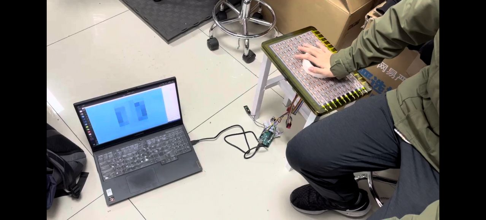
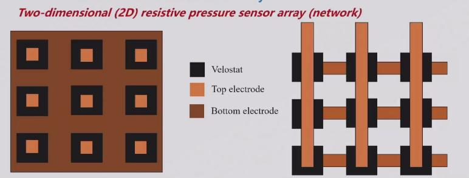

# sitting-posture-detection

sitting posture detection device with arduino 、python

本项目为基于arduino、python、柔性压力传感器阵列的智能坐垫

外观如下：

## 下位机

嵌入式部分采用arduino通过两个多路复用器和柔性压力传感器阵列连接，一个提供一侧扫描的电压，一个读取另一侧的电压，读取的数据分十级通过蓝牙发送到PC，进一步可视化和分析。

传感器阵列用velostat、铜胶带制作，结构如图：

接线图如下所示：

## 上位机

通讯部分用python对蓝牙建立Socket端口

可视化部分用openCV。

分析部分采用Mobilenet V3对采集的压力分布图分类，模型参数采用预训练参数。

训练采用`train.py`，实际使用采用`main.py`

